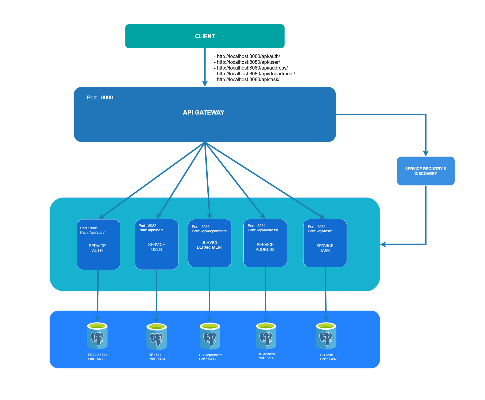
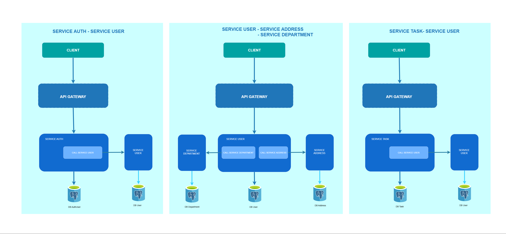

# Microservices Architecture V3 - Circuit Breaker (resilience4j & retry)

This project demonstrates a microservices architecture built using Spring Boot and Resilience4j, implementing fault tolerance with Circuit Breaker and Retry mechanisms.

- Spring Boot
- Spring Security
- Resilience4j (Circuit Breaker & Retry)
- PostgreSQL
- Spring Cloud Gateway (API Gateway)
- Eureka Server (Service Discovery & Registry)
- Swagger (OpenAPI)
- Docker


## Architecture Diagram
<p align="center">
  
</p>


# Service-to-Service Communication
The following interactions occur between services:
- Service Auth  -> Service User
- Service User  -> Sevice Department
- Service User  -> Service Address
- Service Task  -> Service User

<p align="center">
  
</p>


# Example: Calling a Service with Circuit Breaker & Retry (Blocking)
Since this project uses Spring MVC (not reactive), it's acceptable to use .block() on WebClient for synchronous calls.


## Add Dependency in service

Add the following dependencies to your service's pom.xml:

```xml
<dependency>
    <groupId>org.springframework.cloud</groupId>
    <artifactId>spring-cloud-starter-circuitbreaker-resilience4j</artifactId>
</dependency>
<dependency>
    <groupId>io.github.resilience4j</groupId>
    <artifactId>resilience4j-retry</artifactId>
</dependency>
```

### Resilience4j Configuration (application.yml)
```yml
resilience4j:
  circuitbreaker:
    configs:
      default:
        registerHealthIndicator: true
        slidingWindowSize: 10
        minimumNumberOfCalls: 5
        failureRateThreshold: 50
        waitDurationInOpenState: 10000
        permittedNumberOfCallsInHalfOpenState: 3
    instances:
      userService:
        baseConfig: default

  retry:
    instances:
      userService:
        maxRetryAttempts: 3
        waitDuration: 2s
        retryExceptions:
          - org.springframework.web.reactive.function.client.WebClientRequestException
          - java.util.concurrent.TimeoutException

management:
  endpoints:
    web:
      exposure:
        include: health,info,circuitbreakerevents
```


## WebClient Config
```java
@Configuration
public class WebClientConfig {

    @Bean
    @LoadBalanced
    public WebClient.Builder webClientBuilder() {
        return WebClient.builder();
    }

    @Bean
    @Qualifier("userClient")
    public WebClient userWebClient(WebClient.Builder builder) {
        return builder
                .baseUrl("lb://user-service")
                .defaultHeader(HttpHeaders.CONTENT_TYPE, MediaType.APPLICATION_JSON_VALUE)
                .build();
    }
}
```

## Synchronous WebClient with Circuit Breaker & Retry
```java
import com.blackcode.task_service.dto.UserDto;
import com.blackcode.task_service.exception.DataNotFoundException;
import com.blackcode.task_service.helper.TypeRefs;
import com.blackcode.task_service.service.UserClientService;
import com.blackcode.task_service.utils.ApiResponse;
import io.github.resilience4j.circuitbreaker.annotation.CircuitBreaker;
import io.github.resilience4j.retry.annotation.Retry;
import org.slf4j.Logger;
import org.slf4j.LoggerFactory;
import org.springframework.beans.factory.annotation.Qualifier;
import org.springframework.core.ParameterizedTypeReference;
import org.springframework.http.HttpStatusCode;
import org.springframework.stereotype.Service;
import org.springframework.web.reactive.function.client.WebClient;
import reactor.core.publisher.Mono;

import java.time.Duration;

@Service
public class UserClientServiceImpl implements UserClientService {

    private static final Logger logger = LoggerFactory.getLogger(UserClientServiceImpl.class);

    private static final String USER_API_PATH = "/api/user/getUserById/";

    private final WebClient userClient;

    public UserClientServiceImpl(@Qualifier("userClient") WebClient userClient) {
        this.userClient = userClient;
    }

    @Override
    @Retry(name = "userService")
    @CircuitBreaker(name = "userService", fallbackMethod = "fallback")
    public UserDto getUserById(String userId) {
        if (userId == null) return null;

        String uri = USER_API_PATH + userId;
        ParameterizedTypeReference<ApiResponse<UserDto>> typeRef = TypeRefs.userDtoResponse();
        ApiResponse<UserDto> response = userClient.get()
                .uri(uri)
                .exchangeToMono(clientResponse -> {
                    HttpStatusCode status = clientResponse.statusCode();
                    logger.info("Response status: {}", status);

                    if (status.isError()) {
                        return clientResponse.bodyToMono(String.class).flatMap(errorBody -> {
                            logger.error("Error response body: {}", errorBody);
                            return Mono.error(new DataNotFoundException("User not found"));
                        });
                    }
                    return clientResponse.bodyToMono(typeRef);
                })
                .timeout(Duration.ofSeconds(3))
                .block();

        if (response == null) {
            logger.warn("No response for User ID {}", userId);
            return null;
        }
        return response.getData();
    }

    public UserDto fallback(String userId, Throwable throwable) {
        logger.error("Failed get data User by ID {}. Error: {}", userId, throwable.toString());
        return null;
    }
}

```

Note: While blocking with .block() is acceptable in Spring MVC, you should still monitor for performance issues under high load.

# Notes
- This implementation is designed for Spring MVC (non-reactive) projects.
- Using .block() is acceptable in imperative (synchronous) applications, but should be avoided in WebFlux.
- The fallback method must match the original method's parameters and include a Throwable as the last argument.
- This configuration helps your services remain resilient, fault-tolerant, and self-healing.


## Docker & Deployment
This project is fully containerized and ready for deployment using Docker. It includes:
- Containerized services via Docker
- Health checks and restart policies
- Centralized startup using docker-compose

## Run Project
```
docker-compose up --build
```

## Stop Project
```
docker-compose down
```

## API Documentation (Swagger UI)
The API documentation using Swagger UI can be accessed at the following base URL:
```
http://localhost:8080/swagger-ui/index.html
```

## API Endpoints
All requests are sent through the API Gateway at:
```
http://localhost:8080
```


