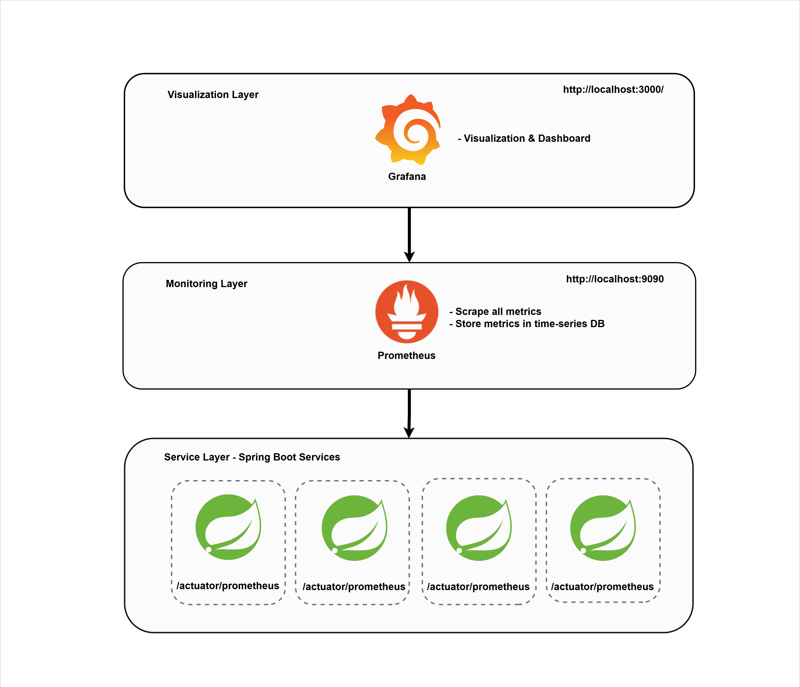

# Microservices Architecture V4 - Monitoring (Prometheus + Grafana)

This project demonstrates a microservices architecture built using Spring Boot and monitored using Prometheus and Grafana.

- Spring Boot
- Spring Security
- Resilience4j (Circuit Breaker & Retry)
- actuator
- prometheus
- PostgreSQL
- Spring Cloud Gateway (API Gateway)
- Eureka Server (Service Discovery & Registry)
- Swagger (OpenAPI)
- Docker


## Service Layer & Monitoring

The microservices architecture with monitoring layers:
<p align="center">
  
</p>


## Architecture Diagram
<p align="center">
  
</p>


# Service-to-Service Communication
The following interactions occur between services:
- Service Auth  -> Service User
- Service User  -> Sevice Department
- Service User  -> Service Address
- Service Task  -> Service User

<p align="center">
  
</p>


## Add Dependency in service

Add the following dependencies to your service's pom.xml:

```xml
  <dependency>
			<groupId>org.springframework.boot</groupId>
			<artifactId>spring-boot-starter-actuator</artifactId>
		</dependency>
  <dependency>
    <groupId>io.micrometer</groupId>
    <artifactId>micrometer-registry-prometheus</artifactId>
  </dependency>
```


## Configuration Monitoring (Prometheus)
Make sure this configuration is at the root level, not under spring:

```yml
global:
  scrape_interval: 5s

scrape_configs:
  - job_name: 'api-gateway'
    metrics_path: '/actuator/prometheus'
    static_configs:
      - targets: ['api-gateway:8080']

  - job_name: 'eureka-server'
    metrics_path: '/actuator/prometheus'
    static_configs:
      - targets: ['eurekaserver:8761']

  - job_name: 'auth-service'
    metrics_path: '/actuator/prometheus'
    static_configs:
      - targets: ['auth-service:8081']

  - job_name: 'user-service'
    metrics_path: '/actuator/prometheus'
    static_configs:
      - targets: ['user-service:8082']

  - job_name: 'department-service'
    metrics_path: '/actuator/prometheus'
    static_configs:
      - targets: ['department-service:8083']

  - job_name: 'address-service'
    metrics_path: '/actuator/prometheus'
    static_configs:
      - targets: ['address-service:8084']

  - job_name: 'task-service'
    metrics_path: '/actuator/prometheus'
    static_configs:
      - targets: ['task-service:8085']
```

### Monitoring Configuration (application.yml)
```yml
management:
  endpoints:
    web:
      exposure:
        include: health,info,prometheus
  endpoint:
    prometheus:
      enabled: true
```


## Docker & Deployment
This project is fully containerized and ready for deployment using Docker. It includes:
- Containerized services via Docker
- Health checks and restart policies
- Centralized startup using docker-compose

## Run Project
```
docker-compose up --build
```

## Stop Project
```
docker-compose down
```

## API Documentation (Swagger UI)
The API documentation using Swagger UI can be accessed at the following base URL:
```
http://localhost:8080/swagger-ui/index.html
```

## API Endpoints
All requests are sent through the API Gateway at:
```
http://localhost:8080
```

# Monitoring URLs

## Prometheus Targets:
```
http://localhost:9090/targets
```

## Grafana Dashboard:
```
http://localhost:3000/
```

- Grafana can visualize metrics from all services via Prometheus.

- Import dashboards using Grafana dashboard ID 4701 for Spring Boot microservices metrics.


